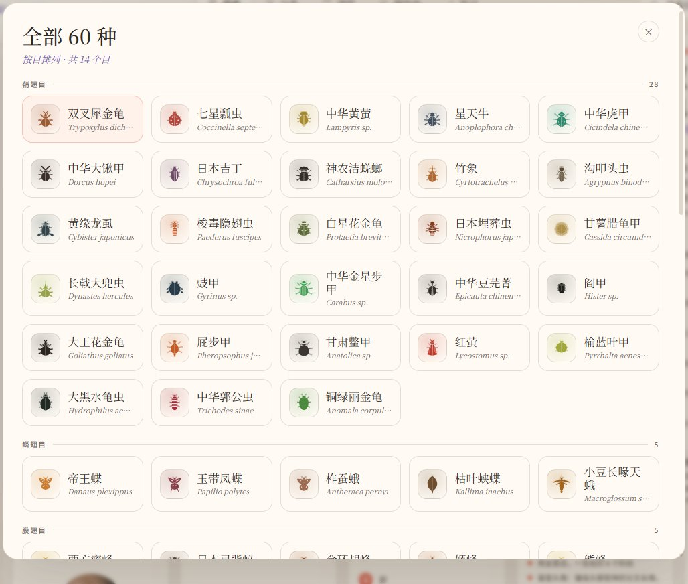
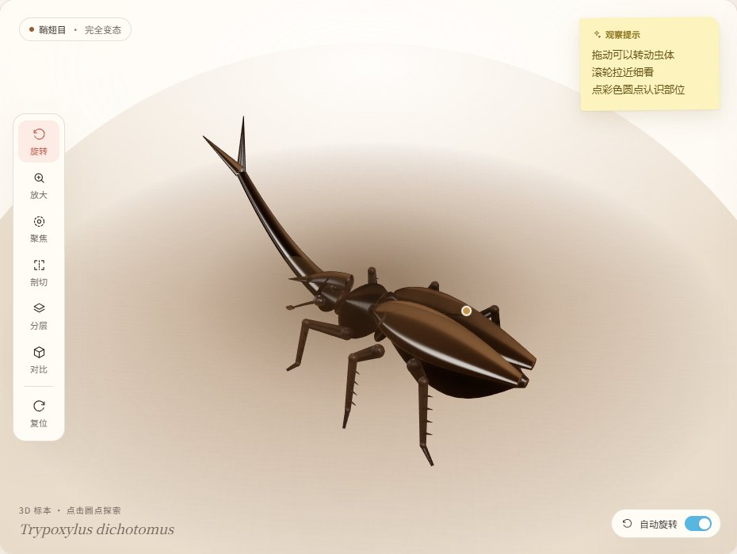
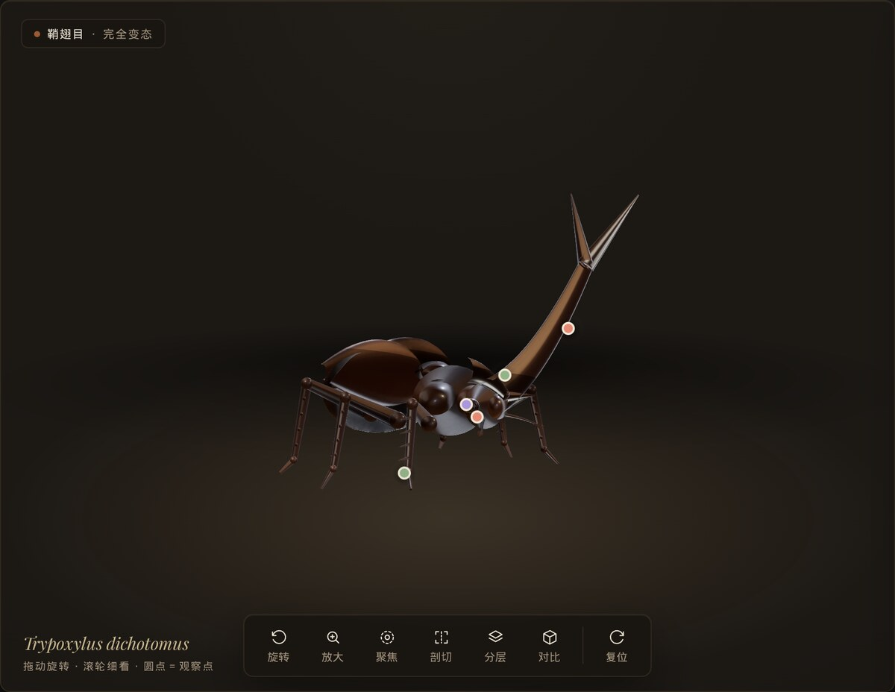
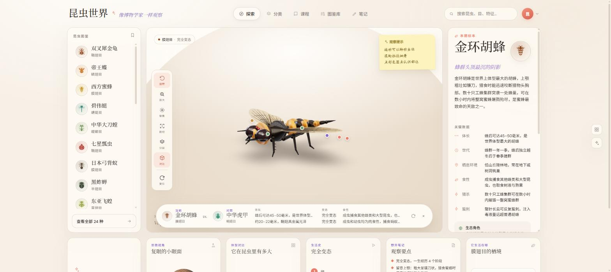

# 昆虫世界

[](https://github.com/xr843/insect-world/actions/workflows/ci.yml)
[](LICENSE)
[![LINUX DO](https://img.shields.io/badge/LINUX-DO-FFB003.svg?logo=data:image/svg%2bxml;base64,DQo8c3ZnIHhtbG5zPSJodHRwOi8vd3d3LnczLm9yZy8yMDAwL3N2ZyIgd2lkdGg9IjEwMCIgaGVpZ2h0PSIxMDAiPjxwYXRoIGQ9Ik00Ni44Mi0uMDU1aDYuMjVxMjMuOTY5IDIuMDYyIDM4IDIxLjQyNmM1LjI1OCA3LjY3NiA4LjIxNSAxNi4xNTYgOC44NzUgMjUuNDV2Ni4yNXEtMi4wNjQgMjMuOTY4LTIxLjQzIDM4LTExLjUxMiA3Ljg4NS0yNS40NDUgOC44NzRoLTYuMjVxLTIzLjk3LTIuMDY0LTM4LjAwNC0yMS40M1EuOTcxIDY3LjA1Ni0uMDU0IDUzLjE4di02LjQ3M0MxLjM2MiAzMC43ODEgOC41MDMgMTguMTQ4IDIxLjM3IDguODE3IDI5LjA0NyAzLjU2MiAzNy41MjcuNjA0IDQ2LjgyMS0uMDU2IiBzdHlsZT0ic3Ryb2tlOm5vbmU7ZmlsbC1ydWxlOmV2ZW5vZGQ7ZmlsbDojZWNlY2VjO2ZpbGwtb3BhY2l0eToxIi8+PHBhdGggZD0iTTQ3LjI2NiAyLjk1N3EyMi41My0uNjUgMzcuNzc3IDE1LjczOGE0OS43IDQ5LjcgMCAwIDEgNi44NjcgMTAuMTU3cS00MS45NjQuMjIyLTgzLjkzIDAgOS43NS0xOC42MTYgMzAuMDI0LTI0LjM4N2E2MSA2MSAwIDAgMSA5LjI2Mi0xLjUwOCIgc3R5bGU9InN0cm9rZTpub25lO2ZpbGwtcnVsZTpldmVub2RkO2ZpbGw6IzE5MTkxOTtmaWxsLW9wYWNpdHk6MSIvPjxwYXRoIGQ9Ik03Ljk4IDcwLjkyNmMyNy45NzctLjAzNSA1NS45NTQgMCA4My45My4xMTNRODMuNDI2IDg3LjQ3MyA2Ni4xMyA5NC4wODZxLTE4LjgxIDYuNTQ0LTM2LjgzMi0xLjg5OC0xNC4yMDMtNy4wOS0yMS4zMTctMjEuMjYyIiBzdHlsZT0ic3Ryb2tlOm5vbmU7ZmlsbC1ydWxlOmV2ZW5vZGQ7ZmlsbDojZjlhZjAwO2ZpbGwtb3BhY2l0eToxIi8+PC9zdmc+)](https://linux.do)

可交互的 3D 昆虫图鉴 —— 旋转、缩放、点击标注点，认识 60 种昆虫的身体构造、生活史与生态角色。

**线上：https://insect-world.pages.dev** · **English: https://insect-world.pages.dev/en/**

**每一只虫都是代码实时生成的，仓库里没有一个模型文件。**

60 个物种覆盖 14 个目：鞘翅目 28、鳞翅目 5、膜翅目 5、半翅目 4、直翅目 4、双翅目 3，蜻蜓目、螳螂目、脉翅目各 2，䗛目、革翅目、广翅目、蜚蠊目、毛翅目各 1。

**长期目标 60 种 / 14 目已达成**；物种史与打磨史见 [docs/roadmap.md](docs/roadmap.md) 与 [docs/polish-plan.md](docs/polish-plan.md)。



双主题视觉，同一个馆的日与夜：默认**「标本台」**（冷灰绿档案衬板 + 青铜铭牌 +
标本标签的印刷墨色），一键切换**「博物馆之夜」**（展厅黑做底、黄铜做骨，标本靠
聚光灯锥与光池从暗场里托出——金属鞘翅、薄膜虹彩、萤火虫的尾灯都在深底上起飞）。

| 浅色「标本台」（默认） | 暗色「博物馆之夜」 |
| --- | --- |
|  |  |

> ⚠️ **关于讲解文本**：60 种昆虫的总述、关键数据、生活史与冷知识**由 AI 撰写，
> 尚未经昆虫学文献或专业人士逐条核校**。当作「看着好玩、顺便认个形态」的读物，
> 别当作可引用的资料；发现错处欢迎开 issue。

## 跑起来

```bash
npm install
npm run dev          # 主站      http://localhost:5178
                     # 模型调试台 http://localhost:5178/preview.html
npm test             # 3116 个测试
npm run build        # tsc --noEmit + vite build
npm run deploy       # 构建并发布到 Cloudflare Pages（需先 npx wrangler login）
```

两个出图脚本（都不进依赖，用到时临时装）：

```bash
bash scripts/make-og.sh    # 重生成分享卡 public/og.png 与图标三件套（需 ImageMagick）
node scripts/shots.mjs     # 重拍 README 截图（无头 Chromium，用法见文件头注释）
```

部署在 Cloudflare Pages，静态托管，无后端。`public/_headers` 配了缓存策略：
产物文件名带内容哈希，按一年不可变缓存；HTML 每次回源校验，保证发新版立刻生效。

## 怎么用

左栏点选，或用 `↑` `↓` 逐只翻。拖动转动虫体，滚轮拉近，点彩色圆点看部位说明。

左侧工具条：**聚焦**把镜头凑到当前标注的部位上，**剖切**沿矢状面切开，**分层**让外骨骼半透明，**对比**在展台底部浮出对照条。

右栏的**读它的图鉴详解**是分步讲解，每翻一步镜头会自己移到讲到的部位上；**小测**是真能作答的，判对错、给解释、统计得分。




## 一个必须先讲清楚的决定：模型是代码生成的

参考站每个器官是一份约 3.2 MB 的 GLB 资产（`/models/heart.glb` 等），属于采购或扫描来的素材。昆虫没有对应的现成资产，所以这里换了条路：**每个物种的几何体由 TypeScript 在浏览器里实时生成**，一行外部模型文件都没有。

这不只是妥协。昆虫的形态比内脏规律得多 —— 体分头/胸/腹三段，胸部生三对足、两对翅，附肢是分节的锥管，翅面由放射状翅脉支撑。这些结构参数化以后，加一个物种只需要写一份尺寸与配色的描述，而不是再买一个模型。代价是写实度不如三维扫描，换来的是零资产依赖、任意可扩展，以及每处形态都能在代码里追溯到形态学依据。

单个物种 1.4 万~3.6 万三角面（最小是蠼螋 14,420，最大是柞蚕蛾 35,732），在浏览器里构建耗时 30~90 毫秒。生产构建首屏 JS gzip 约 424 KB（three 主导的 vendor 340 KB + 主包 84 KB），桌面后期管线 103 KB 为懒加载独立 chunk，手机不下载，物种代码按需分包，点到谁才下载谁。

## 借来的与自写的

学自参考站的是**信息架构**：三栏工作台（图鉴列表 / 3D 展台 / 详情面板）、模型上的彩色
标注点、底部扩展卡片、顶栏五个入口，以及剖切与对比这两件功能的设想 —— 这一层不藏着。
具体实现全部为自写。

自己定的是一条交互原则：每个控件都得有真实响应，不留只有样子的按钮。逐项落到：

| 控件 | 这里的行为 |
| --- | --- |
| 顶栏导航与搜索 | 五个入口都有激活态；搜索实时过滤下拉，总览按目分组 |
| 工具条 Isolate / Layers / Zoom / Reset | 镜头聚焦部位 / 外骨骼半透明 / 拉近一档 / 复位 |
| 剖切与对比 | 裁剪平面真的切开模型；展台底部浮出对比条，另可换对照物种 |
| Quiz 小测 | 真能作答：判对错、给解释、统计得分 |
| 讲解弹窗 | 分 3~4 步，每步把 3D 镜头移到讲到的部位 |

视觉的来历，说清楚：**v1 的配色与版式是照着参考站实测取值复刻的**（奶油纸底
`#f7f0e7` + 珊瑚 `#eb7c6b` + Cormorant Garamond，讲解弹窗连宽度圆角都照抄）。
仓库转公开时这些借来的数值**已全部替换**为自研的两套主题：暗色「博物馆之夜」
（`#131110` 展厅黑 + `#b08d57` 黄铜）与浅色「标本台」（`#e9ebe4` 档案衬板 +
`#7d6128` 青铜 + 砖红/靛蓝/苔绿/赭黄四色标签墨），排印换成 Playfair Display +
Noto Serif SC，弹窗尺寸也换成自己的一套。

## 结构

```
src/
  three/
    builders/
      kit.ts              建模工具箱 —— 所有物种的地基
      surface.ts          程序生成表面微观贴图（刻点/纵沟/微颗粒，运行时 CanvasTexture）
      eyes.ts             复眼六边形小眼面法线贴图
      venation.ts         参数化翅脉网（纵脉+渐密横脉围出真翅室）
      <id>.ts             每个物种一个文件，导出 build<Name>(): InsectModel
    registry.ts           按 id 动态加载物种模块（Vite 代码分割 + LRU 显存回收）
    InsectCanvas.tsx      3D 展台：工作室光照、按需渲染、触角微动、背面圆点淡出
    PostFX.tsx            桌面后期（N8AO + Bloom + 链尾 ACES），懒加载独立 chunk
  components/
    TopBar / LibraryPanel / Stage / DetailPanel / BottomCards   三栏工作台
    Discovery.tsx         讲解弹窗（讲解 / 动态演示 / 小测 / 栖境 四个变体）
    CompareBar.tsx        展台底部的内联对比条
    Gallery.tsx           按目分组的全部物种总览
    InsectGlyph.tsx       60 个手写 SVG 剪影
  data/
    types.ts              数据契约
    insects.ts            60 种昆虫的图鉴数据
    guides.ts             60 种的分步讲解与测验
  preview.tsx             模型调试台（/preview.html）
```

### kit.ts 提供什么

| 类别 | API |
| --- | --- |
| 放样核心 | `loft` `spindle` `segmentedAbdomen`（默认节间凹槽）`segmentedAbdomenMembranes`（节间软膜环） |
| 附肢 | `leg` `legPair` `antenna` `antennaPair` |
| 翅 | `wing` `wingPair` `wingGeometry` `wingVeins` |
| 头部器官 | `compoundEye` `compoundEyePair` `ocelli` `mandibles` `rostrum` |
| 材质 | `chitin`（surface 刻点/纵沟/绒面、translucent 半透）`elytra`（iridescent 虹彩）`membrane`（薄膜虹彩） |
| 收尾 | `finalize` `boundingRadius` `mirrorZ` |

`loft` 是全部几何的地基：给一串椭圆截面，沿路径放样成封闭实体。它对退化输入（重合点、零半径、竖直路径）有专门的测试，因为这些情况一旦产生 NaN，整个模型会静默变成空白。

物种文件只依赖 kit（与 surface/eyes/venation 三个工具模块），彼此不依赖 —— 60 个物种是六轮多 agent 并行写出来的。

### 坐标与数据的约定

模型局部坐标：`+X` 向前（头部方向），`+Y` 向上（背方），`+Z` 向右，单位 1 = 1 厘米真实体长。

`finalize()` 把模型居中并同步平移锚点，返回 `{ group, anchors, radius }`。`radius` 供相机自动取景 —— 竹节虫 10 cm 和瓢虫 0.7 cm 差着 20 倍，靠它归一化。

`anchors` 的 key 是建模层与数据层之间唯一的耦合点：`insects.ts` 里每个 `hotspot.anchor`、`guides.ts` 里每个 `LessonStep.anchor`，都必须能在对应物种的 `anchors` 里找到，否则那个标注点会**静默消失** —— 页面不报错、两边各自的测试也都是绿的。`three/__tests__/integration.test.ts` 专门钉住了这层接缝。

## 加一个物种要做什么

注册表用 `import.meta.glob('./builders/*.ts')` 扫描目录，**文件名直接当 id**，导出的 `buildXxx()` 按 `build` 前缀找。所以放一个新文件进去就自动注册，不必回来改任何现有代码。

但内容还是要一份份写，四处的 id 必须一致：

| 写什么 | 放哪 | 分量 |
| --- | --- | --- |
| 3D 几何生成代码 | `src/three/builders/<id>.ts` | 200–400 行，最费事 |
| 图鉴数据（学名、6 条关键数据、5–6 个标注点、生态、冷知识…） | `src/data/insects.ts` | 一条记录 |
| 讲解与测验（3–4 步 + 2 道题） | `src/data/guides.ts` | 一条记录 |
| 24×24 剪影图标 | `src/components/InsectGlyph.tsx` | 一个小组件 |

漏了会被测试拦下：数据里有记录却没有 builder 文件 → 集成测试失败；某个 `anchor` 在模型上找不到 → 接缝测试失败。

## 踩过的坑

几个只有实际跑起来才会撞上、且都不会被类型检查或 NaN 检查抓到的问题：

**`<Environment>` 会挂起整棵子树。** drei 的 `Environment` 即使只用内联 `Lightformer`（不加载外部 HDR）也可能 suspend。它和模型、灯光共处一个 Suspense 边界时，表现是：canvas 尺寸正常、WebGL 上下文正常、控制台无报错、画面全空。必须给它自己的 `<Suspense>`。

**内联回调会造成无限重载。** `onLoaded` 这类回调若是父组件每次渲染新建的闭包，又进了加载 effect 的依赖数组，就会形成「加载完 → 通知父组件 → 父组件重渲染 → 新回调 → 重新加载」的死循环，同样表现为 3D 区永远空白。回调要放进 ref 再用。

**`legPair` 曾经不是镜像。** 原写法是「把 `base.z` 取负，再翻 `scale.z`」。但 `leg()` 内部算出的腿节方向 z 分量恒为正、不随 `base.z` 变号，于是左腿的基节被翻回右侧，整条腿从右侧根部斜穿过身体中线。三个物种作者独立报告了这个现象。几何完全合法、没有 NaN，只是长错了地方 —— 这类问题只能靠专门的对称性断言抓住（`__tests__/mirror.test.ts`）。

**`wing()` 的 `spread` 语义与直觉相反，且文档自己也错过一回。** 实测是 `180` = 向本侧完全展开、`90` = 沿体轴向前、`0` = 横穿身体伸向**对侧**。早期文档写成「0 = 侧展」，而当时的测试只比对了展开跨度 —— 0 与 180 的跨度一模一样、只是方向相反，于是错误文档被绿灯测试背书，先后坑了两位物种作者。现在 `mirror.test.ts` 连方向一起钉住了，别顺手「修正」实现。

**3D 只在浏览器窗口「可见」时才会渲染，截图因此一度做不出来。** 隐藏标签页没有
`requestAnimationFrame`，r3f 的 Canvas 量不到容器尺寸就永远不挂载子树——症状是
canvas 在、无报错、加载转圈永不消失，而 DOM 外壳照常渲染，于是**截图工具拍到的
是一张「正在生成…」**。判据一行：`document.visibilityState !== 'visible'` 或 600ms 内
rAF 计数为 0，就别再排查渲染代码了。出图改走无头 Chromium（`scripts/shots.mjs`），
那里 visibilityState 恒为 visible，顺带让 README 截图变成可复现的一条命令。

**`elytra()` 的清漆层调太高会整片过曝。** 原值 0.85 配 Environment 的面光源，正对光的角度会把固有色和隆起的体积感一起吃掉 —— 深栗褐的独角仙从正面看像两个白球。压到 0.55 才对。

**`wingVeins()` 的翅脉半径是硬编码的绝对值。** 在 3 单位以上的大翅上细到看不见，帝王蝶因此一度整片糊成均匀褐色。大翅要写按翅宽缩放的局部翅脉。

**标注点必须挂进旋转的那个 group 里。** anchors 是模型的**局部坐标**。如果把 `<Html>` 热点当作兄弟节点摆在场景里，它们会被当成世界坐标固定在空中 —— 静止时看着完全正常、位置分毫不差，一开自动旋转就露馅：虫在转，点不动。修法是让热点成为旋转 group 的 children。

连带还有一处：自转角度是**累加**的，所以「聚焦到某个部位」时不能直接拿局部锚点当目标，必须先套上 group 的世界矩阵，否则自动旋转开着时镜头会对到空处去。聚焦期间也顺手停掉自转 —— 镜头锁死在一点而虫还在转，那个部位会自己溜走。

**测试全绿不等于长得像。** 几何合法性、包围盒比例、面数预算都能自动验，但「这只虫看起来像不像萤火虫」只能用眼睛看。`/preview.html` 就是为此存在的：单物种放大、线框、网格地面、面数与锚点统计。萤火虫的前胸盾片一度被做成两个大椭球（看着像两只虫黏在一起），而所有测试都是绿的。

## 测试

```bash
npm test
```

39 个文件、3004 个测试：

| 文件 | 数量 | 管什么 |
| --- | --- | --- |
| `data/__tests__/guides.test.ts` | 1026 | 讲解与测验的结构、字数、anchor 逐物种校验 |
| `data/__tests__/insects.test.ts` | 907 | 图鉴数据契约、anchor 白名单、trivia 不得复述 summary |
| `components/__tests__/glyph.test.tsx` | 183 | 60 个剪影的结构与坐标越界 |
| `three/__tests__/integration.test.ts` | 183 | 建模层 × 数据层的接缝 |
| `__tests__/layers.test.ts` | 65 | 三层齐备性 + 展示文案字符白名单 |
| `builders/__tests__/kit.test.ts` | 30 | 放样地基与退化输入 |
| `builders/__tests__/*.test.ts`（其余 31 个） | 598 | 各物种形态断言、表面材质落位、翅脉/节间膜/触角钩子普查 |
| `builders/__tests__/mirror.test.ts` | 12 | 成对附肢对称性、`wing` 的 `spread` 语义与方向 |

形态类断言写的时候有个自检标准：**把代码改回出问题的版本，这条断言会失败吗？** 不会就等于没写。

「后足腿节最粗处 ≥ 腿节长的 1/3」这类边界值断言尤其容易写成恰好擦边通过而实际无效 —— 蝗虫那条最初就是 0.333 压线过，看着是绿的其实什么也没管住。后来改成量取真实网格的最大半径，外加一条「两端不许收细到峰值的 28% 以下」，才真正拦得住。

但这条自检标准仍有它管不到的地方，而且是最贵的一块：**断言量的是数字，人看的是长相，两者可以毫无关系。**
兰花螳螂的花瓣状腿节「宽度 ≥ 厚度的 3.5 倍」测出来是 5.75，绿的；渲染出来却是几片侧立的薄板，
整只虫像一只苍白的虾 —— 因为决定朝向的那个四元数只约束了长度轴，绕它的滚转是随意的，
扁平面正好侧对着镜头，而宽厚比这个**数字**丝毫不受影响。
同理，白蚁兵蚁的两颚在世界坐标里分得很开，但默认机位的视线方向恰好把这个分离压扁，
屏幕上糊成一根独角。

能钉住这类问题的断言，必须**量到用户真正看见的那个量**：
兰花螳螂改成断言花瓣的三个维度里有**两个**远大于第三个（一块板只有一个）；
白蚁兵蚁改成把两颚顶点投影到默认机位的成像平面上，沿颚长切 20 段，
断言其中有连续一长段两者的投影包围盒**不相交**。
写形态断言前值得先问一句：这个数字，和我要看的那件事是同一件事吗？

## 已知不足

- 写实度上限仍低于三维扫描 —— 表面微观（刻点/沟纹/绒面/蜂窝复眼）已由程序贴图补足，但没有手绘贴图与真实绒毛物理；换来的是零资产文件与全库风格统一。
- 观察笔记只存在浏览器本地（localStorage），换设备或清缓存就没了；
  头像菜单里的「复制为 Markdown」是目前唯一的带走方式。
- 剖切与分层是通用实现（裁剪平面 / 降低外骨骼不透明度），没有按物种定制解剖层次。
- 部分物种的近缘种列表是按常见中文名写的，未逐条核对分类学文献。
- 英文版（`/en/`）的全部内容是 AI 从中文翻译的，未经母语者校订，也未请昆虫学者
  复核英文术语与常用名。学名（拉丁二名法）两版一致，那是唯一可靠的对照锚点。

## 致谢与许可

**信息架构学自 [Anatomy Atelier](https://anatomy-livid.vercel.app/)**（源码在
[thebuggeddev/anatomy](https://github.com/thebuggeddev/anatomy)）—— 三栏工作台、模型上的
彩色标注点、底部扩展卡片、引导讲解的位置，以及一部分交互手感，都来自它。本项目不含它的
任何代码，全部为自写实现。感谢它把这个交互形态做了出来。

本仓库的 3D 建模代码、图鉴文案、讲解与测验内容、两套视觉主题及全部实现均为原创，
以 MIT 许可发布，见 [LICENSE](LICENSE)。

⚠️ 再说一次：**图鉴文案由 AI 撰写，未经专业核校**，不适合作为学术或教学引用来源。
